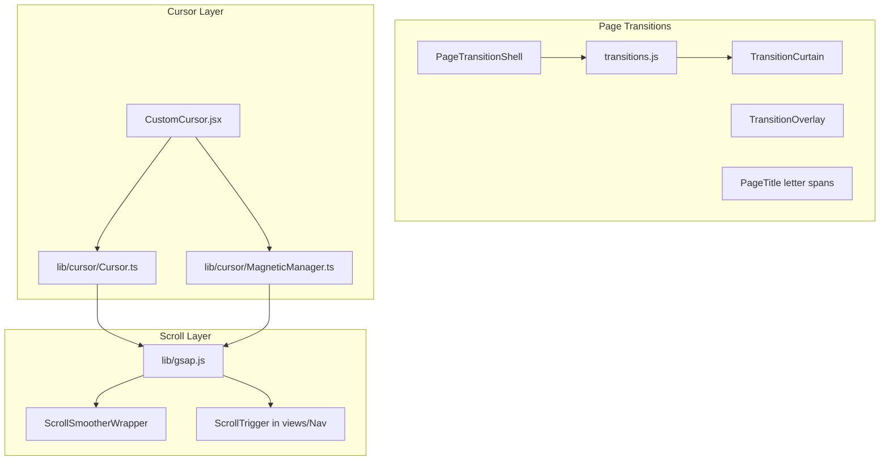

# Animation System

Animation is a first-class architecture concern. **GSAP is the sole animation engine.** Do not add parallel stacks (Framer Motion, the `motion` package, etc.) without explicit approval.

## Architecture



## GSAP entry point

**Always import scroll utilities from `@/lib/gsap`** (registers plugins):

```js
import { gsap, ScrollTrigger, ScrollSmoother, refreshScroll, scrollToTop, setScrollPaused } from "@/lib/gsap";
```

| Export | Purpose |
|--------|---------|
| `gsap`, `ScrollTrigger`, `ScrollSmoother` | Registered re-exports |
| `getScrollSmoother()` | `ScrollSmoother.get()` |
| `scrollToTop(instant?)` | Reset scroll on page change |
| `refreshScroll()` | Refresh smoother + ScrollTrigger after DOM changes |
| `setScrollPaused(paused)` | Pause scroll during transitions |

File: `src/lib/gsap.js`

### ScrollSmoother

`src/components/ScrollSmoother/ScrollSmootherWrapper.jsx` wraps content in `#smooth-wrapper` / `#smooth-content`.

Config: `smooth: 1.2`, `effects: true`, `smoothTouch: 0.1`, `normalizeScroll: true`.

Layout CSS in `src/app/globals.css` (`#smooth-wrapper`, `#smooth-content`).

## Page transitions

Orchestrator: `src/components/PageTransition/PageTransitionShell.jsx`

### Lifecycle

1. **Initial load** — `fadeContentIn` (no curtain)
2. **Navigation** — `slideCurtainUp` → swap slug → `scrollToTop(true)` → `revealContentUnderCurtain`
3. Scroll paused during transition via `setScrollPaused(true)`

### Animation functions

File: `src/components/PageTransition/transitions.js`

| Function | When |
|----------|------|
| `fadeContentIn(contentEl, rootEl)` | First page enter |
| `slideCurtainUp(curtainEl, overlayEl)` | Exit before slug swap |
| `revealContentUnderCurtain(...)` | Enter after curtain covers screen |
| `splitTitleLetters(title)` | Utility |

### Timing constants

| Constant | Value |
|----------|-------|
| `CURTAIN_EASE` | `power4.inOut` |
| `CURTAIN_DURATION` | `0.9` |
| `TITLE_DURATION` | `0.8` |
| `LETTER_STAGGER` | `0.03` |
| `WORD_DELAY` | `0.05` |

### DOM contract for page enter

Views must include:

1. **`PageTitle`** — renders `.page-title-letter` spans for stagger reveal
2. **`.page-enter-fade`** — body content blocks that fade up on enter

Example pattern in views:

```jsx
<PageTitle title="Projects" />
<div className="page-enter-fade">...</div>
```

CSS initial states: `src/components/PageTransition/PageViews.css`

### Portals

- `TransitionCurtain` — z-index 56, portal to `document.body`
- `TransitionOverlay` — z-index 52, dark scrim

## ScrollTrigger usage

| Location | Effect |
|----------|--------|
| `src/views/HomeView.jsx` | Pill circle width scrub on intro |
| `src/components/Nav/Nav.jsx` | Close desktop menu on scroll |

After DOM/layout changes, call `refreshScroll()`.

## Custom cursor & magnetic

React adapter: `src/components/CustomCursor/CustomCursor.jsx`  
Core library: `src/lib/cursor/` (TypeScript, framework-agnostic)

**Deep API reference:** [src/lib/cursor/README.md](../../src/lib/cursor/README.md)

### Enable conditions

Disabled on: touch devices, `prefers-reduced-motion`, viewport `< 768px`.

### Key APIs

```js
import { Cursor, initMagneticElements, CURSOR_EVENTS } from "@/lib/cursor";

const cursor = new Cursor();
const destroyMagnetic = initMagneticElements(document, {
  getStickTarget: () => cursor.stickTarget,
});
```

### Data attributes (interaction contract)

| Attribute | Effect |
|-----------|--------|
| `data-magnetic="true"` | Magnetic pull toward cursor |
| `data-cursor-stick` | Cursor sticks to element |
| `data-cursor-scale` | Scale cursor on hover |
| `data-cursor-blend` | Blend mode (e.g. `difference`) |
| `data-cursor-text` | Show label text |

`TransitionLink` sets `data-cursor-blend="difference"` and `data-cursor-scale="2.8"` by default.

### Events

`cursor:release-stick` — dispatched by Nav when menus open; releases sticky cursor.

Magnetic elements re-scanned on `pathname` change.

## CSS animations

Global utilities in `src/app/globals.css`:

| Class / keyframe | Purpose |
|------------------|---------|
| `.reveal-hidden` / `.reveal-visible` | Legacy CSS reveal (prefer GSAP page enter for new work) |
| `.underline-effect` | Hover underline |
| `.link-arrow` | Arrow gap animation |
| `@keyframes marquee` / `.marquee-track` | Infinite scroll ticker |

Component: `src/components/Marquee/Marquee.jsx` (legacy, unused in active views).

## Icon animation

`lucide-animated` — used only in `src/components/HomeHeroLinkArrow/HomeHeroLinkArrow.jsx`.

## Extension rules

### Do

- Import GSAP scroll plugins from `@/lib/gsap`
- Use `TransitionLink` for internal navigation
- Add page enter targets via `PageTitle` + `.page-enter-fade`
- Use cursor `data-*` attributes for hover interactions
- Call `refreshScroll()` after layout-affecting changes
- Pause scroll during custom full-screen animations via `setScrollPaused`

### Do not

- Import `motion` / Framer Motion for new animations
- Bypass `PageTransitionShell` with raw `<a>` for internal routes
- Create standalone GSAP plugin registration elsewhere
- Animate page titles without `.page-title-letter` structure
- Mount cursor inside scroll wrapper (breaks blend modes)

## Performance

- ScrollSmoother uses `will-change: transform` on `#smooth-content`
- Cursor disabled on mobile/touch to reduce overhead
- All views stay mounted — prefer CSS `visibility`/`aria-hidden` over unmounting
- Batch ScrollTrigger refresh after transitions, not on every frame

## Related

- [design-system.md](./design-system.md) — cursor attribute reference
- [../utilities/utilities-index.md](../utilities/utilities-index.md) — lib modules
- [../components/component-index.md](../components/component-index.md) — transition components
