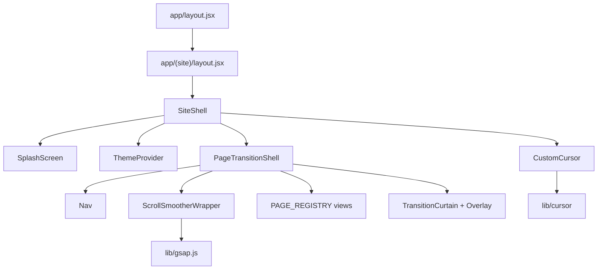

# Architecture Overview

Portfolio site for Muhammad Bilal — a **Next.js 16 App Router** project with **static export** deployed to **GitHub Pages**. The UI runs as a **client SPA shell** on top of Next.js routing: all views stay mounted; visibility and transitions are managed client-side.

## Stack

| Layer | Technology |
|-------|------------|
| Framework | Next.js 16 (App Router, `output: "export"`) |
| UI | React 19 |
| Animation | GSAP 3 (`ScrollSmoother`, `ScrollTrigger`) |
| Styling | Tailwind CSS 3 + co-located CSS + CSS variables |
| Cursor | Custom TypeScript module (`src/lib/cursor/`) |
| Deploy | GitHub Actions → GitHub Pages |

## Hybrid routing model

Next.js provides URL structure, SSG for project slugs, and static HTML export. Actual page content is rendered by `PageTransitionShell` via `PAGE_REGISTRY` in `src/lib/pages.js`.

```
Next route (URL only)     →  PAGE_REGISTRY slug  →  View component
app/(site)/page.jsx       →  /                   →  HomeView
app/(site)/projects/...   →  /projects           →  ProjectsView
app/(site)/projects/[slug]→  /projects/{slug}    →  ProjectDetailView
```

See [routing.md](./routing.md) for details.

## Application flow



### Boot sequence

1. `RootLayout` — theme flash-prevention script, DM Sans `@font-face`, `globals.css`
2. `SiteLayout` — renders `SiteShell` only (does not render `{children}`)
3. `SplashScreen` — preloads assets via `preloadAssets`, then exits
4. `ThemeProvider` — applies `data-theme` on `<html>`
5. `CustomCursor` — mounts GSAP cursor + magnetic system (desktop only)
6. `PageTransitionShell` — mounts all views, runs initial enter animation, handles navigation

## Folder map

```
src/
├── app/                    Next.js routes + globals.css
│   └── (site)/             Route group; pages return null
├── assets/                 Public asset URL exports
├── components/             Reusable UI + shell + motion
├── constants/              Static data (projects, nav, blog)
├── lib/                    Utilities, GSAP, cursor, page registry
├── sections/               Legacy CSS only (styles imported by views)
└── views/                  Active page content (used by PAGE_REGISTRY)
public/
├── fonts/DMSans/           Runtime font files
├── fonts/Gilroy/           Preloaded but not @font-face'd
└── *.png, *.jpg            Static images
```

## Providers & state

No Redux/Zustand. Two React contexts:

| Context | File | Provides |
|---------|------|----------|
| Theme | `src/components/Theme/ThemeContext.jsx` | `theme`, `toggleTheme` |
| PageTransition | `src/components/PageTransition/PageTransitionContext.jsx` | `navigate`, `activeSlug`, `isTransitioning`, `registerPageRef` |

Theme is initialized before hydration via inline script in `app/layout.jsx`.

## Where to add features

| Task | Location |
|------|----------|
| New page/view | `src/views/` + register in `src/lib/pages.js` + App Router stub in `src/app/(site)/` |
| New shared component | `src/components/{Name}/` + document in `docs/components/component-index.md` |
| New animation | Extend `src/lib/gsap.js` or `src/components/PageTransition/transitions.js` — see [animation.md](./animation.md) |
| New scroll effect | Use `@/lib/gsap` ScrollTrigger; refresh via `refreshScroll()` |
| New interactive element | Add cursor `data-*` attributes — see [design-system.md](./design-system.md) |
| Static content | `src/constants/` |
| Design tokens | `src/app/globals.css` `:root` / `[data-theme]` |

## Configuration

| File | Role |
|------|------|
| `next.config.mjs` | Static export, `basePath`, trailing slashes, unoptimized images |
| `tailwind.config.js` | Custom breakpoints, content paths |
| `eslint.config.mjs` | ESLint 9 flat config + `eslint-config-next` |
| `tsconfig.json` / `jsconfig.json` | `@/*` → `./src/*` |
| `.nvmrc` | Node 24 |
| `.github/workflows/` | CI lint/build; manual GitHub Pages deploy |

## Related docs

- [routing.md](./routing.md) — URL ↔ slug ↔ view mapping
- [animation.md](./animation.md) — GSAP, transitions, cursor
- [styling.md](./styling.md) — CSS architecture
- [design-system.md](./design-system.md) — tokens, typography, interaction attrs
- [../features/feature-map.md](../features/feature-map.md) — feature boundaries
- [../components/component-index.md](../components/component-index.md) — component inventory
