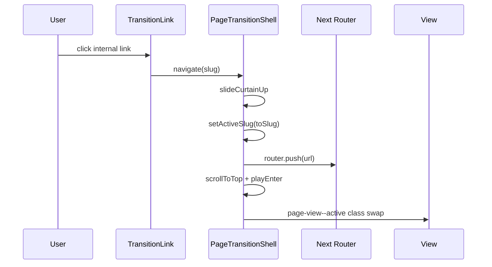

# Routing

## Model

This app uses a **hybrid routing architecture**:

1. **Next.js App Router** — defines URLs, enables static export, generates project slug pages
2. **Client SPA shell** — renders all views simultaneously; toggles active view by slug

Next route files under `src/app/(site)/` return `null`. They exist for URL correctness and SSG, not for rendering page UI.

## Route files

| URL | Next file | Returns |
|-----|-----------|---------|
| `/` | `src/app/(site)/page.jsx` | `null` |
| `/projects/` | `src/app/(site)/projects/page.jsx` | re-exports home page |
| `/projects/[slug]/` | `src/app/(site)/projects/[slug]/page.jsx` | `null` + `generateStaticParams` |
| `/services/` | `src/app/(site)/services/page.jsx` | `null` |
| `/blog/` | `src/app/(site)/blog/page.jsx` | `null` |
| `/contact/` | `src/app/(site)/contact/page.jsx` | `null` |

## PAGE_REGISTRY

Source of truth for view mapping: `src/lib/pages.js`

```js
export const PAGE_REGISTRY = {
  "/": { component: HomeView, title: "Home" },
  "/projects": { component: ProjectsView, title: "Projects" },
  "/projects/{slug}": { component: ProjectDetailView, title, project },
  "/services": { component: ServicesView, title: "Services" },
  "/blog": { component: BlogView, title: "Blog" },
  "/contact": { component: ContactView, title: "Contact" },
};
```

Project detail entries are generated from `projects` in `src/constants/index.js`.

## Slug normalization

`src/lib/slug.js`:

| Function | Purpose |
|----------|---------|
| `normalizeSlug(pathname)` | Strip `basePath`, trailing slash → registry key (e.g. `/projects`) |
| `isInternalPath(href)` | True if `href` starts with `/` but not `//` |

Used by `PageTransitionShell`, `TransitionLink`, `Nav`, `NavRollLink`.

## Navigation flow



### TransitionLink

`src/components/PageTransition/TransitionLink.jsx` — intercepts clicks on internal paths, calls `navigate()` instead of full reload. Always use for in-app navigation.

### Browser back/forward

`PageTransitionShell` syncs `pathname` → `activeSlug`. External URL changes trigger `runTransition` without `updateUrl`.

## Base path (GitHub Pages)

`NEXT_PUBLIC_BASE_PATH=/left-brain-right-pixels` in CI/deploy.

- `src/lib/basePath.js` — `basePath`, `withBasePath(path)`
- `next.config.mjs` — `basePath`, `assetPrefix`, `trailingSlash: true`

`normalizeSlug` strips the base path before registry lookup.

## Adding a new page

1. Create view: `src/views/MyView.jsx`
2. Register in `src/lib/pages.js`:
   ```js
   "/my-page": { component: MyView, title: "My Page" },
   ```
3. Add App Router stub: `src/app/(site)/my-page/page.jsx` returning `null`
4. Add nav entry in `src/constants/index.js` (`NavItems` / `MobileNavItems`)
5. Use `PageTitle`, `.page-enter-fade`, and `TransitionLink` in the view
6. Update `docs/features/feature-map.md` and `docs/components/component-index.md`

## Static params

Project slugs pre-built via `generateStaticParams()` in `src/app/(site)/projects/[slug]/page.jsx` reading from constants.

## Related

- [overview.md](./overview.md)
- [animation.md](./animation.md) — transition lifecycle
- [../features/feature-map.md](../features/feature-map.md)
